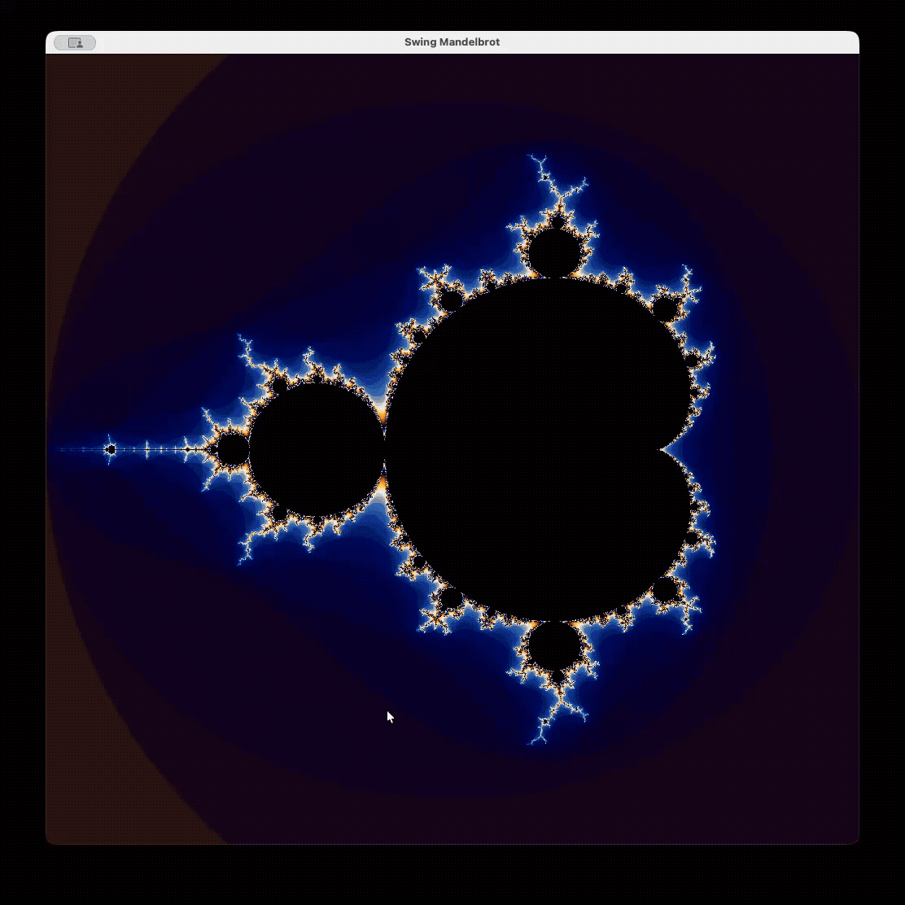

<h1 align = "center">
    JavaMandelbrot
</h1>

## 🧮 Features
JavaMandelbrot is a simple Mandelbrot set visualization 
built with Java and Swing with the following features:

- Zoom in by left-clicking on a point
- Press <kbd>s</kbd> to take a screenshot 
  - Screenshots are saved in the `pictures` directory
- Press the keys <kbd>1</kbd>, <kbd>2</kbd>, <kbd>3</kbd>, <kbd>4</kbd>, <kbd>5</kbd>, <kbd>6</kbd>, and <kbd>0</kbd> to explore different color schemes

## 🌱 Demo

    

